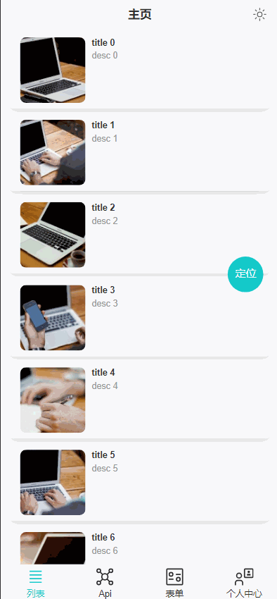

<!-- <p align="center">
  <br>
  
  <br>
  <br>
</p> -->
<p align='center'>
vue-starter-h5 <b>cli + v3 +js</b><sup><em>(speed)</em></sup><br>
</p>

<br>

<p align='center'>
<a href="https://vue-starter-h5.netlify.app/">Live Demo</a>
</p>

<br>

<!-- <p align='center'>
<b>English</b> | <a href="">简体中文</a>
</p> -->

<br>

## Features

- ⚡️ [Vue 3](https://github.com/vuejs/core), [CLI](https://github.com/vitejs/vite),javascript

- 📦 [Components auto importing](./src/components)

- 🍍 [State Management via Pinia](https://pinia.vuejs.org/)

- 🎨 [UnoCSS](https://github.com/antfu/unocss) - the instant on-demand atomic CSS engine

- 😃 [Use icons from any icon sets with classes](https://github.com/antfu/unocss/tree/main/packages/preset-icons)

- 📥 [APIs auto importing](https://github.com/antfu/unplugin-auto-import) - use Composition API and others directly

- 🦾 [API](./src/api) - a simple wrapper for [axios]

- 🎨 [Vant](https://github.com/vant-ui/vant#readme) - Mobile UI Components built on Vue
  <br>

## 🐟 Show

<p align="center">

</p>

### Development

```bash
pnpm i

pnpm dev
```

### Build

To build the App, run

```bash
pnpm build
```
